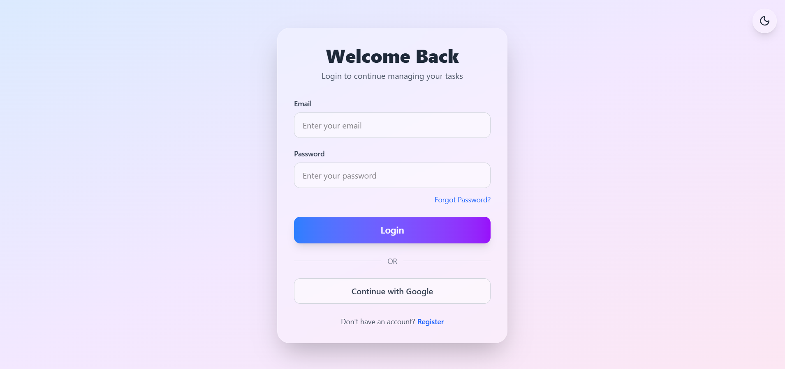
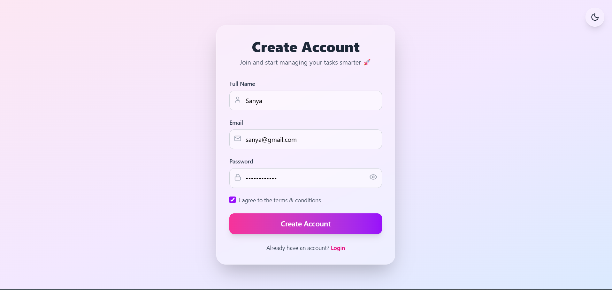
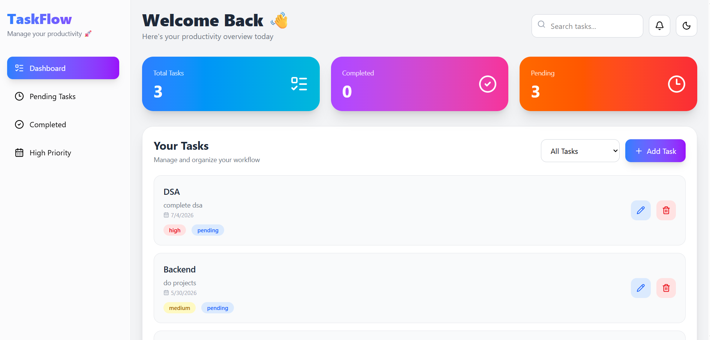

# TaskFlow 🚀

A modern full-stack task management application built with the MERN Stack.

🔗 **Live Demo:** [taskflow-nine-zeta-30.vercel.app](https://taskflow-nine-zeta-30.vercel.app)
📦 **GitHub:** [github.com/sanyaarora2/taskflow](https://github.com/sanyaarora2/taskflow)


---

## Screenshots

### Login


### Register


### Dashboard


---

## Features
- 🔐 User Authentication with JWT
- ✅ Add / Edit / Delete Tasks
- 🔍 Real-time Search & Priority Filtering
- 🌙 Dark Mode
- 📅 Deadline Tracking
- 🛡️ Protected Routes
- 📱 Responsive UI
- ⏳ Loading States

---

## Tech Stack

### Frontend
- React, Tailwind CSS, Axios, React Router DOM, Lucide React

### Backend
- Node.js, Express.js, MongoDB, Mongoose, JWT, bcryptjs

---

## Setup Instructions

### Clone Repository
```bash
git clone https://github.com/sanyaarora2/taskflow.git
cd taskflow
```

### Backend Setup
```bash
cd BACKEND
npm install
```

Create `.env` file:
```
PORT=5000
MONGO_URI=your_mongodb_uri
JWT_SECRET=your_secret_key
```

```bash
npm run dev
```

### Frontend Setup
```bash
cd FRONTEND/task-manager
npm install
npm run dev
```

---

## API Endpoints

### Auth
| Method | Endpoint | Description |
|--------|----------|-------------|
| POST | /api/auth/register | Register user |
| POST | /api/auth/login | Login user |

### Tasks
| Method | Endpoint | Description |
|--------|----------|-------------|
| GET | /api/tasks | Get all tasks |
| POST | /api/tasks | Create task |
| PATCH | /api/tasks/:id | Update task |
| DELETE | /api/tasks/:id | Delete task |

---

## Future Improvements
- 🔔 Toast Notifications
- 🤖 AI Productivity Features
- 🎯 Drag and Drop Tasks
- 📊 Task Analytics Dashboard
- 👥 Team Collaboration